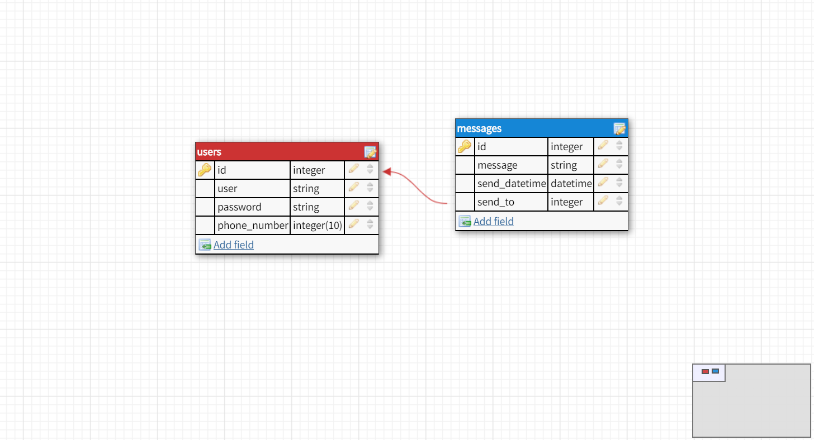
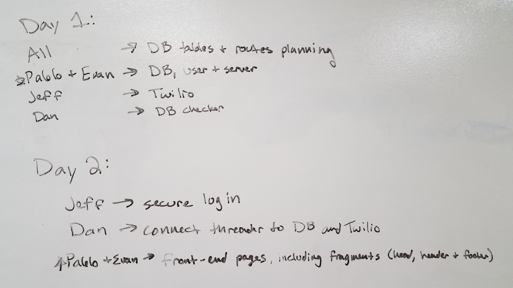

# Esc
Java 401 Midterm Project

The Team: [Daniel Logerstedt](https://github.com/daniellogerstedt), [Pablo Rosales](https://github.com/Pablito14), [Jeff Borda](https://github.com/jeffborda) and [Evan Slaton](https://github.com/evanslaton)

## Description
Esc ([pronounced /əˈskāp/](https://www.merriam-webster.com/dictionary/escape?pronunciation&lang=en_us&dir=e&file=escape01)) is an app that allows a user to compose a message, specify a time the user wants to receive that message, and then delivers that message as an SMS at the specified time.

Practical Application:
* When you commit to a social engagement and want to have an excuse to leave early
* To send yourself a reminder
* To impress someone who might have visual access to your phone

## Database Model

## User Stories
* As a user, I want to be able to send myself a text message (that I wrote) at a time that I specified, so I can use the text as an excuse to get out of uncomfortable situations, remind myself to do something or impress someone. (the end goal which may be a total of 20 hours)
* As a user, I want to be able to signup so that I don't have to re-enter my personal information each time I visit the app. (10 hours)
* As a user, I want my personal information to be stored safely so only I can access it.(We think this will take 3 hours of the previous story)
* As a user, I want to be able to login so that I can access my personal data. (We think this will take 2 hours of the previous story)
* As a user, I want to have a delete message option, to cancel a message being sent. (1 hour)
* As a user, I want to have a be able to view all of my pending/queued messages, to review a message being sent and see that all the details are correct. (1 hour)
* As a developer, I want to ensure that user data is stored safely. (We think this will take 3 hours of the first story)
* As a developer, I want the system to check the database once a minute to check which messages need to be sent. (2 hours)

### Stretch
* As a user, I want to be able to send **someone else** a text message (that I wrote) at a time that I specified, so **they** can use the text as an excuse to get out of uncomfortable situations, remind themselves to do something or impress someone. (4 hours)
* As a developer, I want users to interface with a clean and simple front-end. (8 hours)

## Possible Features
* Dead Man's Switch: sends a message to someone after a specified set of time, if the user doesn't respond, sends an SMS to the people the user specified

## Third Party Resources:
* [Twilio](https://www.twilio.com/docs/sms)

## License
MIT License

## Team Agreement
**Communication Plan**: How will your group communicate with each other? What is your strategy for ensuring everyone’s voices are heard, and that contributions from both Communication plan: How will your group communicate with each other? What is your strategy for ensuring everyone’s voices are heard, and that contributions from both loud and soft voices are listened to? Do you have a plan for managing psychological safety?

* Primarily through slack, a quick stand up in the morning, and another one after lunch. (kanban / issues on Github)

**Conflict Plan**: What will your group do when it encounters conflict? What will your process be to resolve it?

* If two people are stuck at an impasse, put it on hold until the next stand up. If it continues to escalate or can't be resolved, seek a third party (like a T/A or instructor) to arbitrate.

**Work Plan**: How you will identify tasks, assign tasks, know when they are complete, and manage work in general? In particular, make sure you know how you’ll track whether everyone is contributing equally to all parts of the application and that each person is working on “meaty” problems.
* Make sure everyone contributes to both the front and back ends. We can assign tasks by starting with our strengths and delegating on where we need to.

## Task breakdown

## Task assingment

**Holiday Work Plan**: Evan will not be available 12/24 - 12/31
* Evan, Dan and Jeff are working Sat 12/22
* The team will not work over the course of next week (12/24 - 12/28)
* Evan will work 1/1 to compensate for one of the days he won't be present
* Business as usuall starting 1/2

**Git Process**: What is your Git flow? How many people must review a PR? Who merges PRs?

* All work has to be on a branch, 2 people reviews required to merge, the second reviewer should merge it. When we have our application up and running, create a staging branch to act as a protective layer for our master branch.

**Anything Else**: expectations around work times, standup times, taking breaks/seeking help when you’re stuck, etc.

* Pablo will have the role of project manager to organize the groups work.

## Sources
* Styling anchor tags: https://www.w3schools.com/css/css_link.asp
* CSS Grid: https://css-tricks.com/snippets/css/complete-guide-grid/
* SVG Background: https://www.svgbackgrounds.com